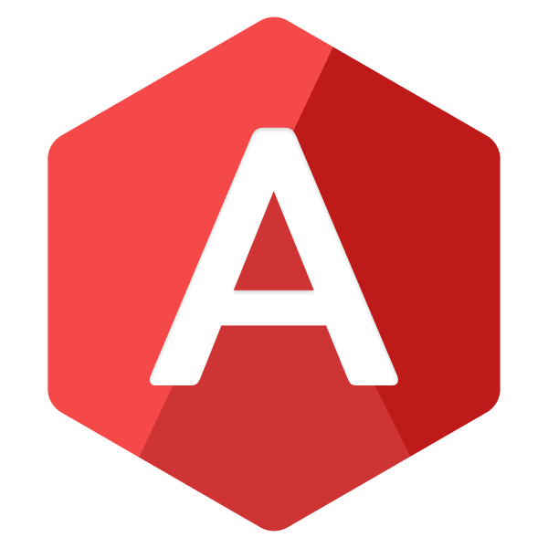

    <h1>The ADAN Programming Language</h1>
    
    

        A dynamically typed language using the <i>design of</i> Python and the <i>speed of</i> C++. <b>Made for focusing on problem solving over complexity</b>.
    

<h3 align="left">
 <i>Simplify low level programming</i>.
</h3>